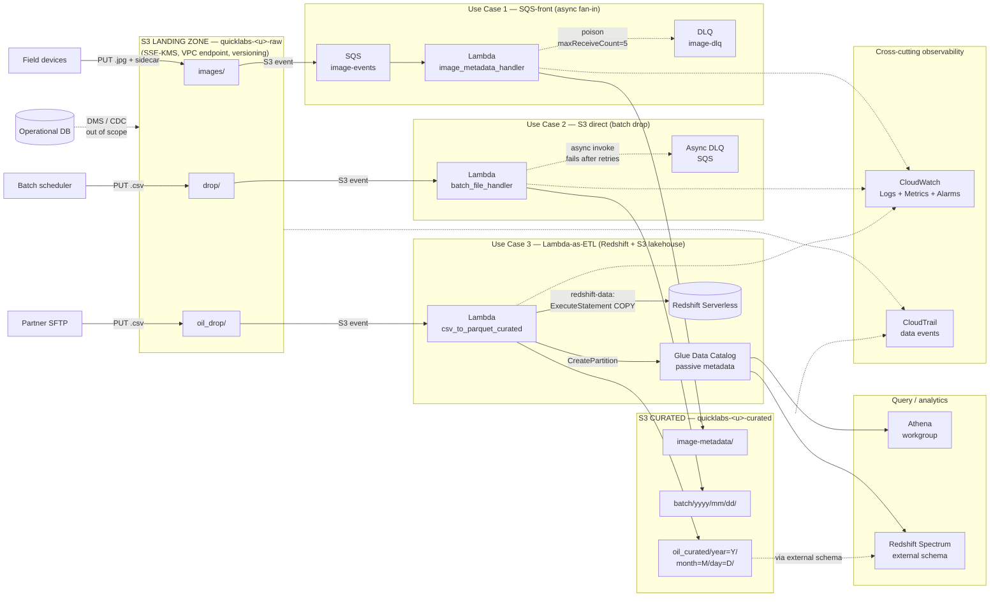
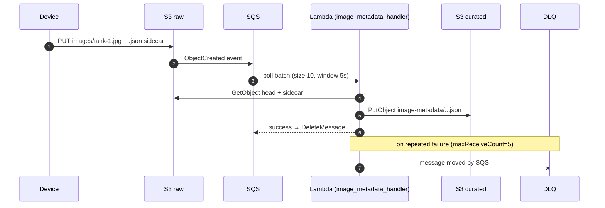
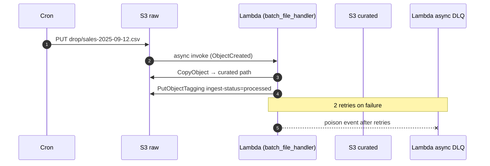
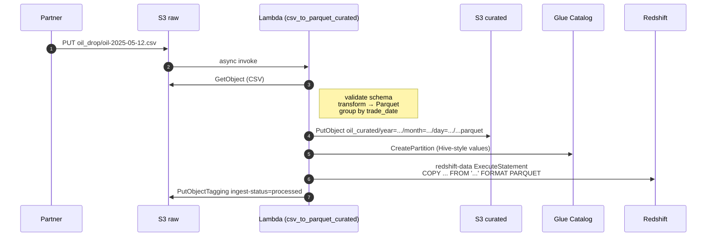

# Event-driven ingestion architecture — S3 as the landing zone

One overview diagram covering all three use cases from `student-lambda-lab.md`. Use this on the opening slide of Module 4 / Lab 2 so students can return to it as you walk each pattern.

---

## ASCII overview (for the markdown doc / terminal-rendered view)

```
                              External producers
   ┌────────────────────┬────────────────────┬────────────────────────┐
   │                    │                    │                        │
   ▼                    ▼                    ▼                        ▼
┌──────────┐      ┌──────────┐      ┌──────────────┐         ┌──────────────────┐
│ Field    │      │ Batch    │      │ Partner SFTP │   ...   │ Operational DB   │
│ devices  │      │ scheduler│      │ drop         │         │ (Postgres / etc) │
└────┬─────┘      └────┬─────┘      └──────┬───────┘         └──────────────────┘
     │                 │                   │
     │   PUT *.jpg     │   PUT *.csv       │   PUT *.csv
     │   + sidecar     │                   │
     ▼                 ▼                   ▼
╔═══════════════════════════════════════════════════════════════════════════╗
║                  S3 LANDING ZONE — quicklabs-<u>-raw                      ║
║                  (SSE-KMS, VPC endpoint only, versioning on)              ║
║                                                                            ║
║   images/        drop/              oil_drop/                              ║
║   ├─ tank-1.jpg  ├─ sales-09-12.csv ├─ oil-2025-05-12.csv                  ║
║   └─ tank-1.json └─ ...             └─ ...                                 ║
╚═══════╤═══════════════╤═════════════════════╤════════════════════════════╝
        │               │                     │
        │ S3 events     │ S3 events           │ S3 events
        │ (ObjectCreated, prefix-filtered, suffix-filtered)
        │               │                     │
        ▼               ▼                     ▼
┌──────────────┐  ┌──────────────┐    ┌────────────────────┐
│              │  │              │    │                    │
│   USE 1      │  │   USE 2      │    │   USE 3            │
│   SQS-front  │  │   Direct     │    │   Lambda-as-ETL    │
│              │  │              │    │                    │
│  ┌────────┐  │  │              │    │  validate ─┐       │
│  │  SQS   │  │  │              │    │  parquet   │       │
│  │ image- │  │  │              │    │  partition │       │
│  │ events │  │  │              │    │  catalog   │       │
│  └───┬────┘  │  │              │    │  COPY ─────┘       │
│      │       │  │              │    │                    │
│      ▼       │  │              │    │                    │
│  ┌────────┐  │  │  ┌────────┐  │    │  ┌──────────────┐  │
│  │ Lambda │  │  │  │ Lambda │  │    │  │ Lambda       │  │
│  │ image- │  │  │  │ batch- │  │    │  │ csv-to-      │  │
│  │ meta-  │  │  │  │ ingest │  │    │  │ parquet-     │  │
│  │ data   │  │  │  │        │  │    │  │ curated      │  │
│  └───┬────┘  │  │  └───┬────┘  │    │  └─┬────┬────┬──┘  │
│      │       │  │      │       │    │    │    │    │     │
│      │poison │  │      │poison │    │    │    │    │     │
│      ▼       │  │      ▼       │    │    │    │    │     │
│  ┌────────┐  │  │  ┌────────┐  │    │    │    │    │     │
│  │ DLQ    │  │  │ Lambda     │  │    │    │    │    │     │
│  │ image- │  │  │ async DLQ  │  │    │    │    │    │     │
│  │ dlq    │  │  │ (SQS)      │  │    │    │    │    │     │
│  └────────┘  │  │              │  │    │    │    │    │     │
└──────┬───────┘  └──────┬───────┘    │    │    │    │     │
       │                 │             │    │    │    │     │
       │ JSON sidecar    │ copy        │   ┌▼┐  ┌▼┐  ┌▼┐    │
       │ metadata        │             │   │ │  │ │  │ │    │
       ▼                 ▼             ▼   │ │  │ │  │ │    │
╔══════════════════════════════════════════│═│══│═│══│═│════╗
║       S3 CURATED — quicklabs-<u>-curated │ │  │ │  │ │    ║
║                                          │ │  │ │  │ │    ║
║  image-metadata/   batch/yyyy/mm/dd/     │ │  │ │  │ │    ║
║                                          │ │  │ │  │ │    ║
║  oil_curated/year=Y/month=M/day=D/  ◀────┘ │  │ │  │ │    ║
║                                            │  │ │  │ │    ║
╚════════════════════════════════════════════│══│═│══│═│════╝
                                             │  │ │  │ │
                                             │  ▼ ▼  │ │
                                       ┌─────│──────┐│ │
                                       │ Glue       ││ │  CreatePartition
                                       │ Data       ││ │  (passive metadata —
                                       │ Catalog    ││ │   no crawlers, no ETL)
                                       └─────│──────┘│ │
                                             │       │ │
                                             ▼       ▼ ▼
                                       ┌─────────────────────┐
                                       │ Redshift Serverless │
                                       │ (COPY via           │
                                       │  redshift-data API) │
                                       └─────────────────────┘

                       ─────────────────────────────────────
                              Cross-cutting observability
                       ─────────────────────────────────────

   CloudWatch Logs (/aws/lambda/quicklabs-<u>-*)
   CloudWatch Metrics (Invocations, Errors, Duration, ConcurrentExecutions)
   CloudWatch Alarms (Errors > 0 for 5 min, DLQ.ApproximateNumberOfMessages > 0)
   CloudTrail (data events on raw + curated buckets)
```

---

## Mermaid version (renders inline on GitHub / GitLab / many wikis)



---

## Per-use-case sequence diagrams (Mermaid)

### Use Case 1 — SQS-fronted fan-in



### Use Case 2 — direct invoke



### Use Case 3 — Lambda-as-ETL



---

## Gemini image prompt (for slide-ready visual)

> Wide isometric AWS architecture diagram, 16:9, professional flat-vector style with AWS service icons. Three horizontal lanes flowing left-to-right.
>
> **Top of canvas — "Producers" layer**: three icon groups — field devices (drone + tablet), a batch scheduler (clock), a partner SFTP server.
>
> **Center — "S3 Landing Zone" band**: one large S3 bucket icon labeled `quicklabs-<u>-raw`, with a lock-shield badge indicating SSE-KMS encryption. Three prefixed sub-folders called out: `images/`, `drop/`, `oil_drop/`.
>
> **Three parallel processing lanes below the landing zone**:
> - **Lane 1 (top)**: S3 event → SQS queue icon (labeled "image-events") → Lambda icon ("image_metadata_handler"). A dashed red arrow drops from Lambda to a small DLQ queue icon ("image-dlq"). Labeled "Use Case 1 — SQS-fronted fan-in".
> - **Lane 2 (middle)**: S3 event → Lambda icon ("batch_file_handler") direct, no SQS. Dashed red arrow to a Lambda async DLQ icon. Labeled "Use Case 2 — Direct invoke".
> - **Lane 3 (bottom)**: S3 event → Lambda icon ("csv_to_parquet_curated") with three small inline tags reading "validate", "Parquet", "partition". Three forward arrows fan out from this Lambda to: an S3 curated bucket, a Glue Data Catalog icon, and a Redshift Serverless icon. Labeled "Use Case 3 — Lambda-as-ETL".
>
> **Right side — "Curated S3 bucket" band**: one S3 bucket icon labeled `quicklabs-<u>-curated`, with three sub-folders: `image-metadata/`, `batch/yyyy/mm/dd/`, `oil_curated/year=.../month=.../day=.../`.
>
> **Bottom — "Observability band"** spans the full width: CloudWatch (logs + metrics + alarms) and CloudTrail (data events) with dotted lines tying back up to all three Lambda functions and both S3 buckets.
>
> **Color palette**: AWS orange (#FF9900) for service icons, slate gray (#37475A) for connecting lines, soft blue accent (#3B6BAA) for the landing/curated bands, red (#D13212) for the dashed DLQ arrows. White background. Heavy use of whitespace. Small AWS Architecture Icons sticker-style labels under each service. 16:9 aspect ratio, 1920×1080 minimum.

---

## What each piece of the diagram is doing

| Element | Why it's there |
|---|---|
| **S3 raw bucket** as a single landing zone | One trust boundary for producers; all downstream wiring is internal to your AWS account |
| **Prefix-based event filtering** (`images/`, `drop/`, `oil_drop/`) | Multiple processing patterns in one bucket without cross-talk — pattern selection is a property of where the producer drops |
| **SQS in front of Lambda (UC1)** | Decouples upload bursts from processing rate; gives per-message retry + DLQ; lets Lambda processing fall behind without losing events |
| **Direct invoke (UC2)** | Saves a hop when producer rate is predictable and DLQ semantics from Lambda's async-invocation retry policy are enough |
| **Lambda-as-ETL (UC3)** | Replaces Glue ETL + crawlers for orgs on the Redshift+S3 lakehouse architecture; Lambda owns validate / Parquet / partition / catalog / COPY |
| **DLQs (one per pattern)** | Poison-message containment — bad payloads don't block the queue or burn invocation budget |
| **Glue Data Catalog** | Passive metadata store — populated by Lambda's `CreatePartition`, read by Athena and Redshift Spectrum. No Glue ETL, no crawlers |
| **Redshift Serverless** | Optional in UC3 — gated on `REDSHIFT_WORKGROUP` env var. Without it, the same data is queryable via Spectrum directly on the curated bucket |
| **Curated bucket as the publish boundary** | Downstream consumers (Athena, Spectrum, dashboards) only ever read curated; raw is private to ingestion |
| **CloudWatch + CloudTrail band** | The "this works in prod" half — without observability tied to every component, you can't operate it |

---

## When to project this on the wall

- **Module 4 opener slide** — start by drawing only the producers + landing zone, then add one lane per use case as you teach them
- **Mid-module recap** — when transitioning from Use Case 2 to Use Case 3, return to this diagram and highlight what changes (Lane 3 grows new outbound arrows to Glue Catalog + Redshift)
- **Day 1 close / Day 2 transition** — leave it on screen during Q&A; many of Day 2's Lake Formation concepts attach to the Glue Catalog box in the lower-right
