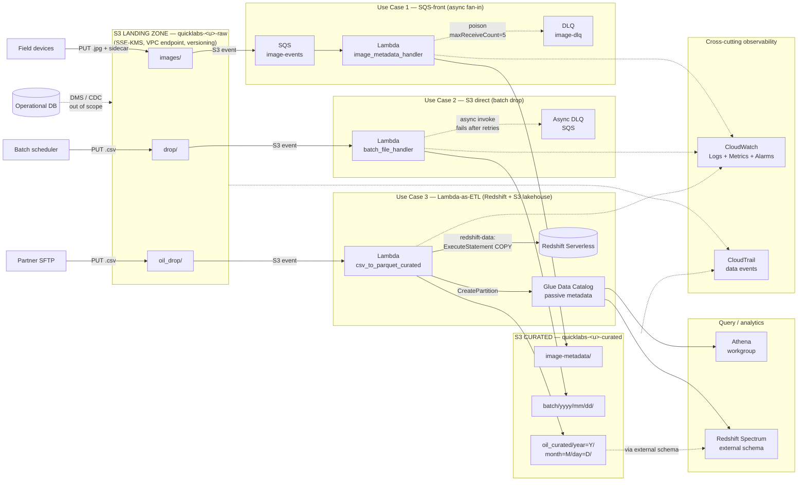
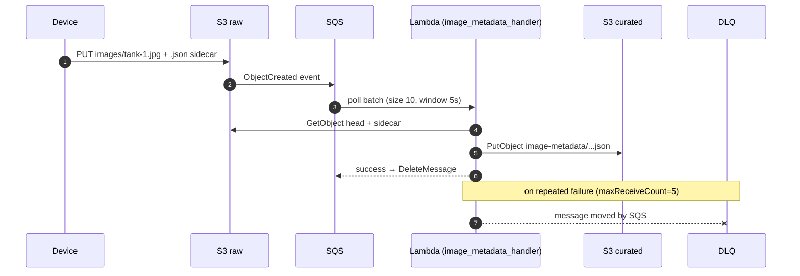
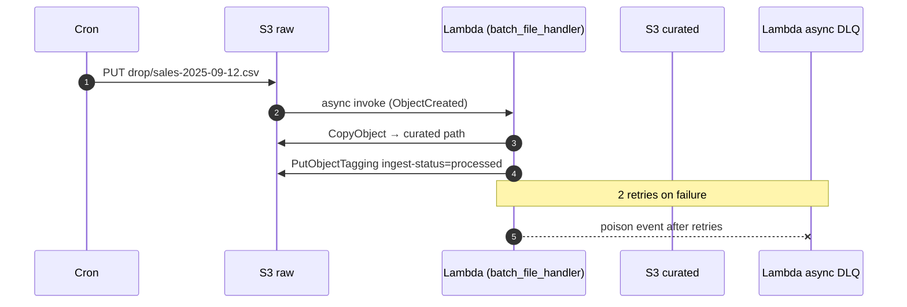
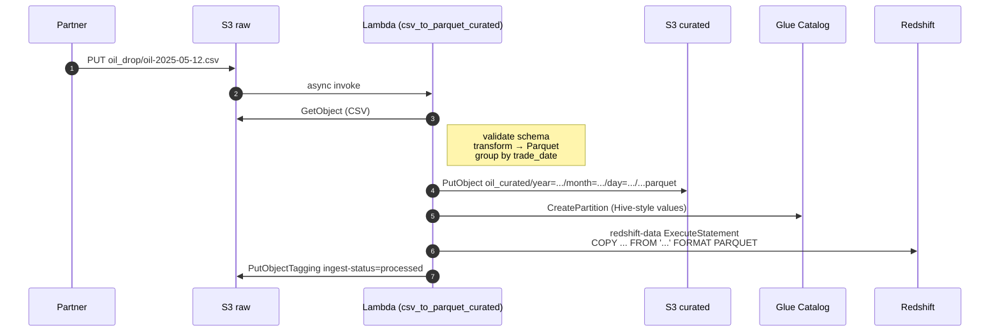

# Event-driven ingestion architecture — S3 as the landing zone

One overview diagram covering all three use cases from `student-lambda-lab.md`. Use this on the opening slide of Module 4 / Lab 2 so students can return to it as you walk each pattern.

---
---

## Mermaid version (renders inline on GitHub / GitLab / many wikis)

---

## Per-use-case sequence diagrams (Mermaid)

### Use Case 1 — SQS-fronted fan-in

### Use Case 2 — direct invoke

### Use Case 3 — Lambda-as-ETL

