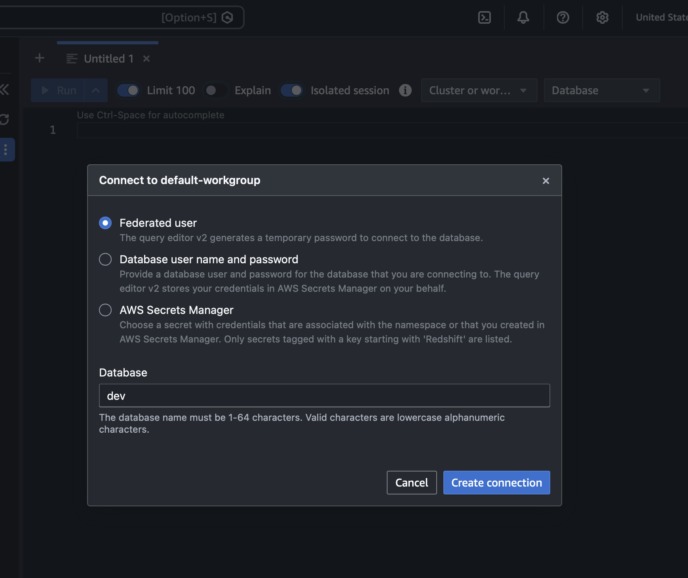
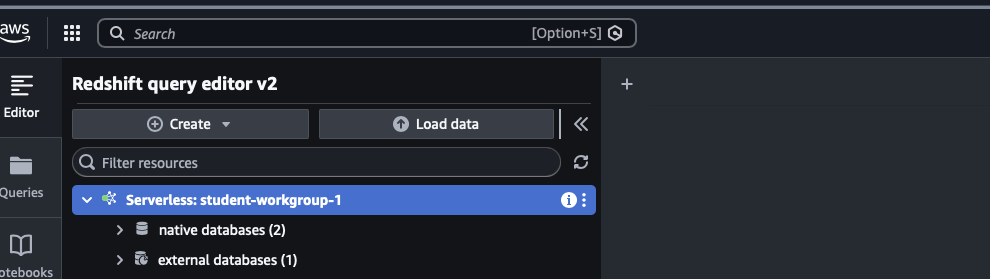
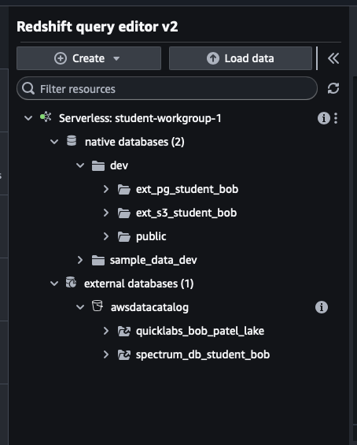

# Redshift Serverless — Student Labs

Welcome! In these two labs you'll connect Amazon Redshift Serverless to live and
external data, then query it.

  Lab 1 — Query a live Aurora PostgreSQL database (Federated Query)
  Lab 2 — Query data files sitting in Amazon S3 (Redshift Spectrum)

Everyone shares the same Redshift workgroup. You keep your work separate by
putting your student number in every name you create.


You have been assigned a number, e.g. 01, 02, 03 ...

Everywhere you see  NN  in this handout, replace it with YOUR number.

Example: if you are student 04, then
  ext_pg_studentNN     becomes   ext_pg_student04
  ext_s3_studentNN     becomes   ext_s3_student04
  spectrum_db_studentNN becomes  spectrum_db_student04

IMPORTANT: Use YOUR number consistently. If two students use the same name,
your tables will clash. The instructor is studentNN = 00 for the demo.


## What you will see in the Query Editor (read this first — it's normal)

When you click on the workgroup in Query Editor v2 you will see two sections:


1. In the AWS Console, open Amazon Redshift -> Query editor v2.
2. In the left panel, click the shared workgroup the instructor points you to.
3. A connection dialog will appear. Select **Federated user** (no password
   needed — Query Editor v2 generates a temporary one for you). Make sure the
   **Database** field shows `dev`, then click **Create connection**.

   

4. Make sure the database selected at the top is: dev


**native databases** (schemas you create live here, under `dev`) and
**external databases** (the shared AWS Glue catalog).




In the left-hand catalog tree you will see databases that OTHER students created
(like `spectrum_db_student02`) and a few shared ones (`awsdatacatalog`,
`spectrum_db`). This is normal — the AWS Glue catalog is shared across the whole
account, so everyone sees everyone's external databases.

After you complete both labs, your expanded catalog will look like this — your
schemas appear under `dev` (native) and your Spectrum database appears under
`awsdatacatalog` (external):



Just use YOUR OWN names and ignore the rest. You only write to your own.


## LAB 1 — Query S3 Data with Redshift spectrum


Goal: create external tables over data files in Amazon S3 and query them like
normal tables — without loading them into Redshift.

You'll use the public TICKIT sample sales data, already placed in S3 at:
  s3://quicklabs-raw-data/tickit/spectrum/sales/

--- Step 1: Create YOUR external schema (and your own Glue database) ---

Replace NN with your number. Note spectrum_db_studentNN must be unique to you.

    CREATE EXTERNAL SCHEMA ext_s3_studentNN
    FROM DATA CATALOG
    DATABASE 'spectrum_db_studentNN'
    REGION 'us-west-2'
    IAM_ROLE 'ROLE_ARN'
    CREATE EXTERNAL DATABASE IF NOT EXISTS;

Run it. CREATE EXTERNAL DATABASE IF NOT EXISTS makes your own Glue database
named spectrum_db_studentNN. Use the same ROLE_ARN from Lab 1.

--- Step 2: Create the SALES external table ---

This points at the S3 sales files. The data is TAB-separated, so the table uses
FIELDS TERMINATED BY '\t'. Replace NN with your number.

    CREATE EXTERNAL TABLE ext_s3_studentNN.sales (
        salesid     INTEGER,
        listid      INTEGER,
        sellerid    INTEGER,
        buyerid     INTEGER,
        eventid     INTEGER,
        dateid      SMALLINT,
        qtysold     SMALLINT,
        pricepaid   DECIMAL(8,2),
        commission  DECIMAL(8,2),
        saletime    TIMESTAMP
    )
    ROW FORMAT DELIMITED
        FIELDS TERMINATED BY '\t'
    STORED AS TEXTFILE
    LOCATION 's3://quicklabs-raw-data/tickit/spectrum/sales/'
    TABLE PROPERTIES ('numRows'='172000');

Run it.

--- Step 3: Query your S3 data ---

    SELECT * FROM ext_s3_studentNN.sales LIMIT 10;

You should see sales rows coming straight from S3.

--- Step 4: Run an aggregate query ---

Find the top events by total sales:

    SELECT eventid, SUM(pricepaid) AS total_sales
    FROM ext_s3_studentNN.sales
    WHERE pricepaid > 30
    GROUP BY eventid
    ORDER BY total_sales DESC
    LIMIT 10;

CHECK YOUR WORK: the top three eventid values should be 289, 7895, and 1602.
If you see those, your setup is correct.

--- Step 5 (bonus): see which S3 file each row came from ---

    SELECT "$path", salesid, pricepaid
    FROM ext_s3_studentNN.sales
    LIMIT 5;

The $path column shows the exact S3 file behind each row.

Lab 2 done. You queried files in S3 as if they were Redshift tables.


## LAB 2 — Federated query to Auroa PostgreSQL

Goal: run SQL in Redshift that reads a live Aurora PostgreSQL table directly,
with no copying.

Your instructor will give you these two values before you start:

```
AURORA_ENDPOINT = 
ROLE_ARN        = 
SECRET_ARN      = 
```


--- Step 1: Create YOUR federated external schema ---

Paste this into the editor. Replace NN with your number, and paste the three
values your instructor gave you.

    CREATE EXTERNAL SCHEMA ext_pg_studentNN
    FROM POSTGRES
    DATABASE 'postgres'
    SCHEMA 'public'
    URI 'AURORA_ENDPOINT'
    PORT 5432
    IAM_ROLE 'ROLE_ARN'
    SECRET_ARN 'SECRET_ARN';

Run it. You should see a success message.

--- Step 2: Query the live Aurora data ---

    SELECT * FROM ext_pg_studentNN.customers LIMIT 10;

You should see customer rows. This data lives in Aurora, not Redshift — you're
reading it live.

--- Step 3: Try a real query ---

    SELECT region, COUNT(*) AS num_customers
    FROM ext_pg_studentNN.customers
    GROUP BY region
    ORDER BY num_customers DESC;

Lab 1 done. You queried a live PostgreSQL database from Redshift.


## LAB 3 — Cross course Join query - Joining S3 and RDS

```
SELECT
    c.region,                                   -- from Aurora (federated)
    COUNT(DISTINCT s.salesid)   AS num_sales,   -- from S3 (Spectrum)
    SUM(s.pricepaid)            AS total_revenue
FROM ext_s3_studentNN.sales       AS s          -- S3 via Spectrum
JOIN ext_pg_studentNN.customers   AS c          -- live Aurora Postgres
    ON s.buyerid = c.id
GROUP BY c.region
ORDER BY total_revenue DESC;
```

```
SELECT 'from S3'     AS source, COUNT(*) FROM ext_s3_studentNN.sales
UNION ALL
SELECT 'from Aurora' AS source, COUNT(*) FROM ext_pg_studentNN.customers;
```

## If something goes wrong


| What you see                              | What to do                                              |
|-------------------------------------------|---------------------------------------------------------|
| "schema ... already exists"               | Someone (maybe you) used that name. Use your own NN.    |
| "authentication method 10 not supported"  | Tell instructor — Aurora user needs md5 (instructor fix)|
| Glue / CreateDatabase not authorized      | Tell instructor — role not attached to namespace        |
| S3 access denied / 0 rows                  | Check LOCATION is exactly the line above, ending in /   |
| "relation does not exist"                 | You're querying the wrong schema name — check your NN   |

To start a lab over, drop your schema and re-create it:

    DROP SCHEMA ext_s3_studentNN;     -- or ext_pg_studentNN

WHAT YOU LEARNED


- Federated query: Redshift reading a live PostgreSQL database, no copy.
- Spectrum: Redshift querying raw files in S3 as external tables, no load.
- External schemas live in your namespace; the Glue databases behind Spectrum
  are shared account-wide (that's why you see everyone's).
- One Redshift workgroup can serve many people — you stay separate by naming.